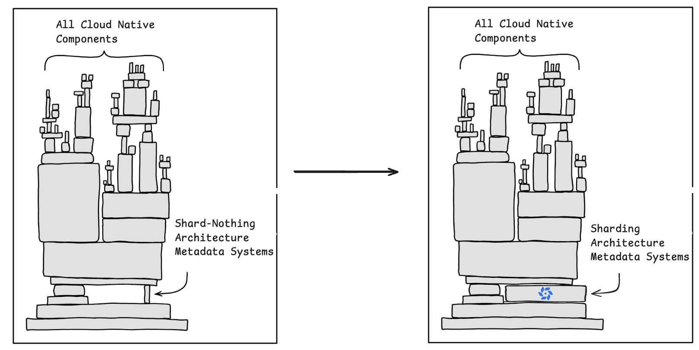

  

<h2 align="center">Oxia</h1>
a robust, scalable metadata store and coordination system designed for large-scale distributed systems, with built-in support for stream index storage to optimize real-time data management.

  <a href="https://github.com/oxia-db/oxia/blob/main/docs/getting-started.md">Getting Started </a> | <a href="https://github.com/oxia-db/oxia/tree/main/docs">Documentation</a>

  
  
  
  

   

### Why Oxia

Original image credited to  xkcd.com/2347, alterations by Qiang Zhao.

Oxia offers a sharding architecture designed to efficiently manage distributed metadata. In the world of cloud-native applications, scalability and high availability are essential. Traditional systems with a shard-nothing architecture are great for consistency but often face limitations when handling extremely large datasets or high-throughput scenarios. This is where Oxia shines.

With Oxia, you get a scalable, robust, and flexible solution for managing metadata in distributed systems, allowing you to unlock the potential of modern cloud-native architectures.

 

### Contributing to Oxia

Please 🌟 star the project if you like it. 

Feel free to open an [issue](https://github.com/oxia-db/oxia/issues/new) or start a [discussion](https://github.com/oxia-db/oxia/discussions/new/choose). You can also follow the development [guide]() to contribute and build on it.

### License

Copyright 2023 StreamNative, Inc.

Licensed under the Apache License, Version 2.0: http://www.apache.org/licenses/LICENSE-2.0
