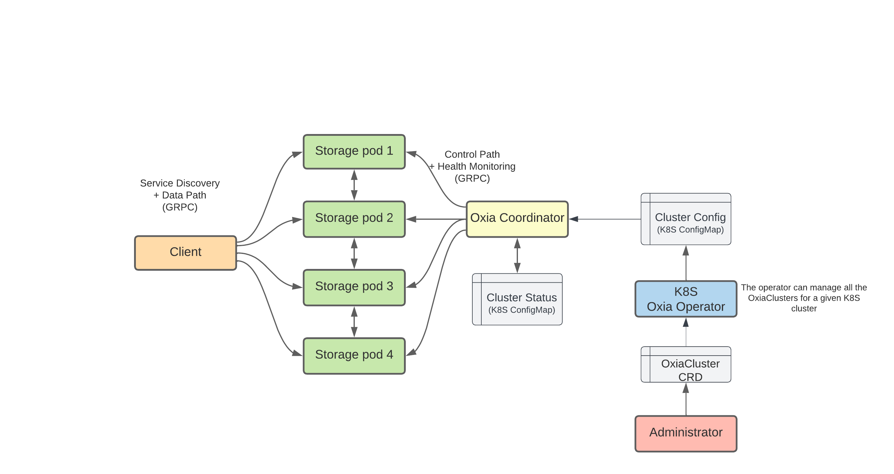
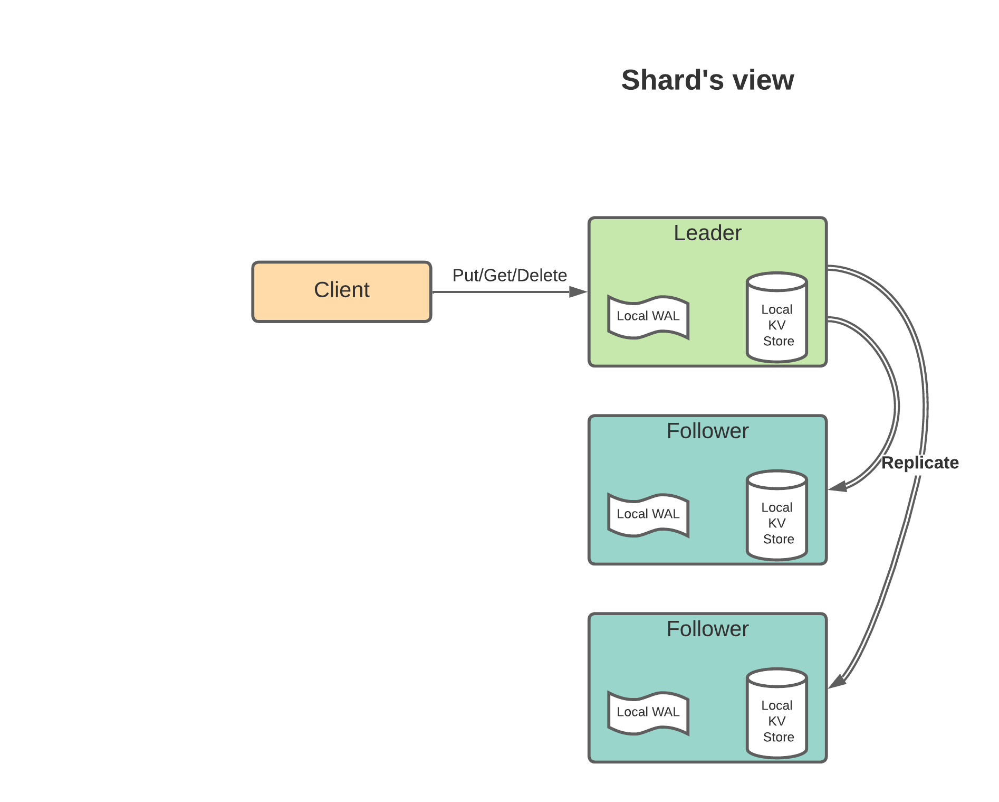

# Oxia Architecture

An Oxia cluster, running in a Kubernetes environment has a few components.



### Oxia Coordinator

The Oxia Coordinator is in charge of 2 main tasks:
 1. Perform error detection and recovery
 2. Coordinate storage nodes and takes part in the leader election process

The coordinator uses the Cluster config as input and the ClusterStatus as a way to checkpoint the current status of 
all the shards.

### Cluster Status

This information is stored as a ConfigMap and contains the current status of all the shards in the cluster.

```json
{
  "clusterStatus": {
    "namespaces": {
      "my-namespace": {
        "replicationFactor": 3,
        "shards": {
          "0": {
            "status": "SteadyState",
            "term": 0,
            "leader": {
              "public": "oxia-1:6001",
              "internal": "oxia-1:7001"
            },
            "ensemble": [
              {
                "public": "oxia-1:6001",
                "internal": "oxia-1:7001"
              },
              {
                "public": "oxia-2:6002",
                "internal": "oxia-2:7002"
              },
              {
                "public": "oxia-3:6003",
                "internal": "oxia-3:7003"
              }
            ],
            "int32HashRange": {
              "min": 0,
              "max": 4294967295
            }
          }
        }
      }
    },
    "shardIdGenerator": 0,
    "serverIdx": 0
  },
  "version": "6"
}
```

The information included allows to know who's the leader of each shard, which storage pods are assigned as part of the
ensemble for the shard, and the `term`. It is critical that the term is stored here, to ensure we will always use a
monotonically increasing term for each different leader election.

This will protect against multiple coordinator processes that might be ending up running at the same time.


### Client

This is an application using Oxia through the Oxia client library.

The client library will handle the service discovery, the sharding and batching of requests and will communicate with
storage pods using a gRPC protocol. The client-server protocol can be found at [client.proto](../../proto/client.proto).

### Storage pods

The storage pods are acting under the direction of the Oxia coordinator. 

The coordinator will include the storage pods as part of the ensemble for some shards and, based on the leader
election outcome, it will be either in `leader` or `follower` mode.

Storage pods _do not_ perform health/liveness checks against each others. It's only the coordinator that is charged to
determine whether a particular storage pod is "up" or "down".


## Data replication

When looking at single shard, all the write/read operations will be only allowed to happen in the leader. 

The leader will log all the write operations in the local WAL and then push them to the followers. Once it receives 
acknowledgment from a majority of the servers in the ensemble (including itself), it will apply the change to the 
local KV store.



A more in-depth discussion of the replication protocol can be found in 
[Oxia replication protocol](../consensus/replication-protocol.md).