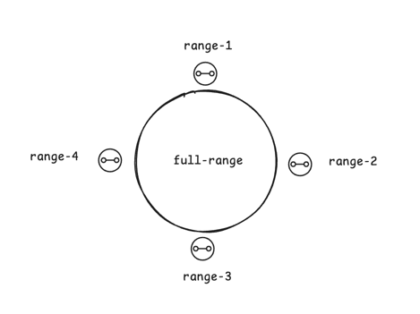
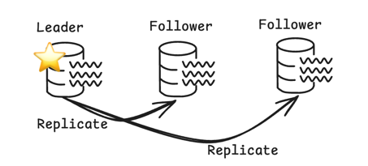
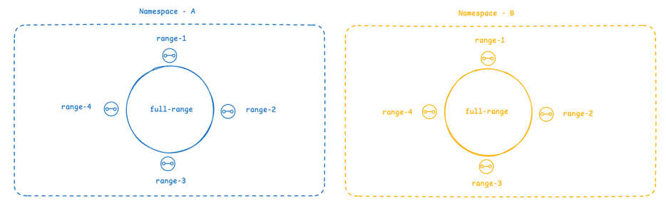

# Oxia Logical Architecture

Followed by [Design Goal](./design-goals.md). the logical architecture is as follows:

- Sharding
- Leader Based
- Multi-Namespaces

## Sharding

Sharding is a method of distributing data across multiple machines or servers to improve scalability and performance.
In Oxia, sharding is implemented to handle large datasets by dividing them into smaller, more manageable parts, known as "shards."
Each shard contains a subset of the data, allowing parallel processing across different nodes.

The Oxia supports sharding of keys, which means that the keys used to access data are distributed across various shards.
This helps in optimizing read and write operations, as requests for data can be routed to the appropriate shard instead of one central server.
As a result, Oxia can efficiently scale horizontally, handle a higher volume of requests, and ensure better fault tolerance and data availability.

In the architecture diagram above, you can see how data is partitioned across multiple shards,
and the process of sharding ensures that data is evenly distributed, allowing for optimal performance and reliability.

## Leader Base

The Leader Base architecture is designed to optimize the management of data and tasks in a distributed system.
In this model, a central "leader" node is responsible for coordinating and overseeing the operations of other nodes, ensuring consistency, reliability, and efficient resource usage.

In Oxia, the Leader Base ensures that one node is designated as the leader at any given time.
This leader node is responsible for directing and managing operations, such as data writes, coordination of reads, and handling replication.
The leader node is key to maintaining strong consistency in the system, as it controls the flow of operations across the distributed architecture.

Other nodes, known as followers or replicas, rely on the leader for updates, ensuring that data across the system remains synchronized.
If the leader fails, a new leader is elected to take its place, ensuring the system remains operational without interruptions.

The architecture shown above demonstrates how the leader node interacts with the follower nodes to manage tasks and data.

## Multi-Namespaces

Multi-Namespaces is a feature that enables the creation of isolated environments within a single instance or cluster, allowing for better organization, security, and scalability in a distributed system. Each namespace acts as a separate container or logical partition, where resources, data, and configurations are managed independently of other namespaces.

In Oxia, Multi-Namespaces allows you to logically segment your data, applications, and services into multiple namespaces.
This is particularly useful in scenarios where you need to support different tenants, applications, or use cases within the same infrastructure,
while keeping their operations isolated from one another. Each namespace operates independently, ensuring that actions in one namespace do not
interfere with those in others.

Key benefits of Multi-Namespaces in Oxia include:

- **Data** Isolation: Each namespace has its own data, preventing cross-contamination between different applications or users.
- **Security**: With namespaces, you can enforce security policies tailored to each namespace, ensuring strict access control and segregation.
- **Scalability**: By isolating workloads into separate namespaces, Oxia can scale resources efficiently for each application or tenant.
- **Flexibility**: Developers and administrators can manage and configure each namespace independently, allowing for a more flexible and customizable environment.

The architecture diagram above illustrates how namespaces are structured, with ranges inside each namespace. This approach allows for greater control over resource allocation and data organization across different applications or environments.