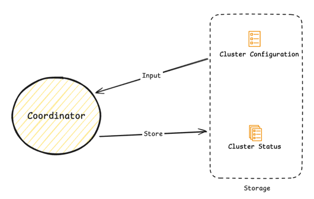
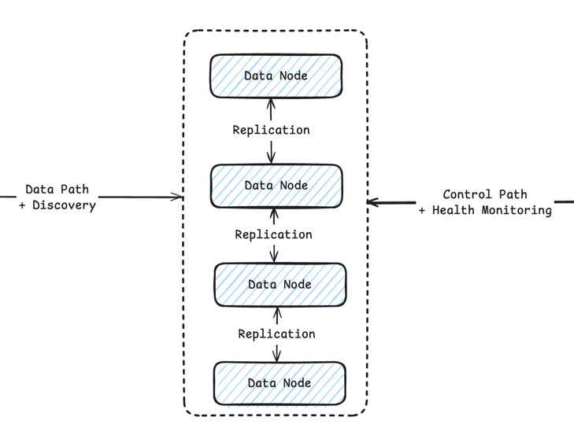

# Oxia Physical Architecture

As a distributed metadata storage, Oxia can be split into two major components, as shown in the diagram above.

- Coordinator
- Data Node

## Coordinator

The Oxia Coordinator is a stateless component that is in charge of some main tasks:

1. Coordinate data nodes and takes part in the leader election process
2. Perform error detection and recovery
3. Perform Shards/Leader load balance

The coordinator uses the [configuration]() as input and the [status]() as a way to checkpoint the current status of
all the shards.

- For the Kubernetes environment, it's easy to use `ConfigMap` to store that data and ensure high availability.
- For the Bare Metal environment, you can write it to a local file for testing or shard-nothing metadata storage for high availability.

> We might consider supporting store status and metadata to the data node for bootstrapping. But need more discussion here.
>

## Data Node

The Oxia Data Node is a stateful component that is in charge of some main tasks:

1. Provide the public endpoint to the client for interacting with data.
2. Provide the internal endpoint to the coordinator or other data node for data replication and leader election, etc.
3. Provide the ability to store data**.