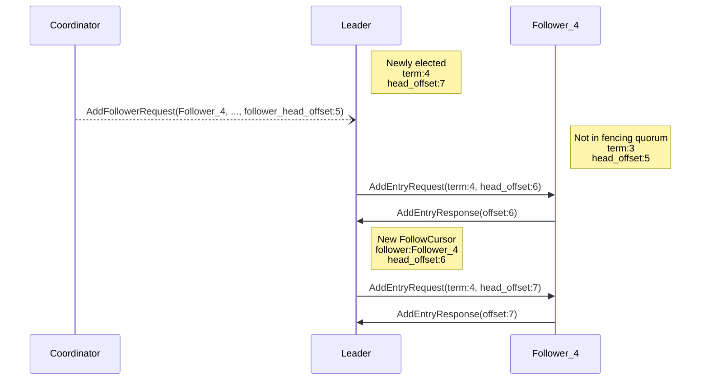
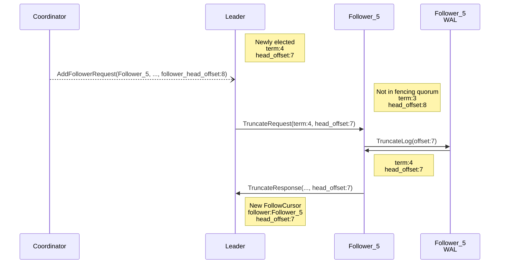

# Coordinator

Here we describe the larger part of the replication protocol that is principally concerned with the coordination of 
relationships between the storage nodes of a cluster.

Fundamentally this requires a single coordinator process and a set of storage nodes. It is the responsibility of the 
coordinator to define and effect the relationships between storage nodes (who is leader, who is a follower). Once the 
coordinator has done this, the storage nodes are able to work together without further interaction with the coordinator.
The coordinator will only get involved again when it deems it necessary to redefine the relationships between the nodes
(scale up/down, node failure, etc.)

## Terminology

### Term

A counter belonging to a shard that is incremented every time a new leader selection is **started** by the coordinator. 
The purpose of the term is to allow followers to differentiate between requests that arrive from prior and newly elected
leaders, thus potentially polluting the log. The term sequence begins at `0`, with an initial state of `-1` designating 
an undefined state. Terms are generated by the coordinator. Typically, only messages tagged with the current term will 
be acted upon by storage nodes and the rest will be ignored as they must have originated from a system state that likely
no longer exists. (The only exception is the `NewTerm` request which will sync the node into a newer, higher term).

### Fencing

When a new leader election is started, the coordinator stops data replication within the shard. It does this by moving
followers and the leader to the “Fenced” state by sending them a `NewTerm`. This has the effect of incrementing the 
term, for all the shard’s nodes and removing the leadership role from the current leader. When in this state, nodes wait
to either be told to become the leader (via the coordinator), or append entries from a leader (i.e become a follower).

### Truncation

The removal of entries appended in the previous term, from the head of a node’s log, so that its dataset is consistent 
with that of a leader node. This is required only when, after a leader election, a new follower happens to be ahead of a
new leader.

## Error handling

### Follower failure

If the coordinator detects that a follower is down, it will not perform any action. The ensemble will keep working 
and the leader will still have a majority, required to accept new write requests.

### Leader failure

If the leader of a shard fails, the coordinator is responsible to ensure the correctness of the system, and will start
a new leader election.

## Anatomy of a leadership election

> As mentioned elsewhere, a [formal description](correctness.md) of the protocol is available in 
> [TLA+](https://lamport.azurewebsites.net/tla/tla.html).

### Fence Nodes

#### Instruction from the coordinator

To rearrange the roles and relationships between a shard’s storage nodes, the coordinator must first bring an end to the
current arrangement. Concretely, it must bring an end to the current term and signal the start of a leader election. It
does this by sending a shard’s current ensemble of storage nodes a `NewTerm` request. Importantly this request includes 
the value of the new term, which all the nodes are expected to adopt. The leader will take the `NewTerm` as a signal of
the end of its reign, and at this point it will become a regular node in the new term.

#### Gathering state from the storage nodes

Nodes in the shard’s ensemble will return a `NewTermResponse` to the coordinator. This conveys a key piece of information
— the node’s `head_offset` for the shard — the most recent entry that it was able to write to it’s WAL.

### Assign a Leader

#### Become Leader

The coordinator will assign a leader for the shard as soon as it has a quorum of `NewTerm` responses. It does not need
to wait for responses from the whole ensemble. Now, in this set of responses it the coordinator now has a picture of the
positions of each of the nodes within the shard data stream via the returned `head_offset`. To choose a new leader, the
coordinator simply picks the node with the most recent entry (the greatest `head_offset` from the previous epoch) as it
can be assumed to be the closest replica of the previous leader.

With a leader selected, the coordinator informs the node in question by passing it a `BecomeLeaderRequest`. Within the
request it includes the other nodes in the fencing ensemble, and their positions so that the leader can catch-up these 
new followers.

The storage node that is leader will signal its acceptance of leadership by returning a `BecomeLeaderResponse` to the
coordinator.

#### Catch-up followers

Given that the followers might be behind the new leader (their `head_offset` will be less than that of the leader and 
they won’t have the most recent entries in their WAL), the leader must now catch-up its followers. Using the information
provided in the `BecomeLeaderRequest` follower map, the leader can now send and missing entries to followers by opening
a `Replicate` stream to them.

> ⚠️ Note the additional subtext of the `Replicate` stream here — it is acting not only as a channel to append entries,
> but also as a signal to become a follower.

The responses to these requests are described in the [storage](replication-storage.md) section of the protocol. The
follower is now in a steady state will receive `Append` requests from the leader.

### Finalize ensemble

> 🧵 This will occur concurrently with **Catch-up followers**

#### Add followers

> ℹ️ In the TLA+, `Append` requests does not have a companion `AppendResponse`. However, there is an empty stub response
> in the protobuf implementation.

You will recall that only a quorum of nodes is required to assign a leader. This means that some nodes in the shard’s 
ensemble are not yet known to the leader. Consequently, the coordinator now instructs the leader to adopt these remaining
nodes as followers. It does so by sending the leader `AddFollowerRequest`. Much like the follower map in the 
`BecomeLeaderRequest`, the `AddFollowerRequest` includes information on the nodes `head_offset`. As before, the leader 
may have to catch-up the new followers, in which case it’d send `Replicate` as described previously.

However, another possibility exists…

#### Truncate followers

Nodes that were not present in the fencing quorum may have a `head_offset` in the **previous** term that is more advanced (greater) than that of the new leader. When electing a leader in the fencing quorum, the coordinator so far avoided truncations by choosing the node with the highest `head_offset` as leader — meaning that other nodes in the quorum will therefore have lower values and thus not need truncation. However, outside of the fencing quorum this might not hold true; perhaps in the previous term the follower being added now was the leader, or maybe it was a ‘faster’ follower? In this eventuality, the node must be truncated before it can follow so that the log of entries for the prior term are the same on all nodes. Quite simply, the node must dispose of any entries that the leader does not have.

The leader instructs followers to truncate by issuing `TruncateRequests` to any new followers who require it. When the leader receives `TruncateResponses` from followers, it starts `[FollowCursors](Storage%203889d3c230e74dcdbbf405f72978a60c.md)` for each follower at the head offset indicated in the respective response.

After the truncate, the system is in a steady state and followers will receive `Append` requests from the leader.

### Return to steady state

The shard’s node ensemble has returned to a steady state.
