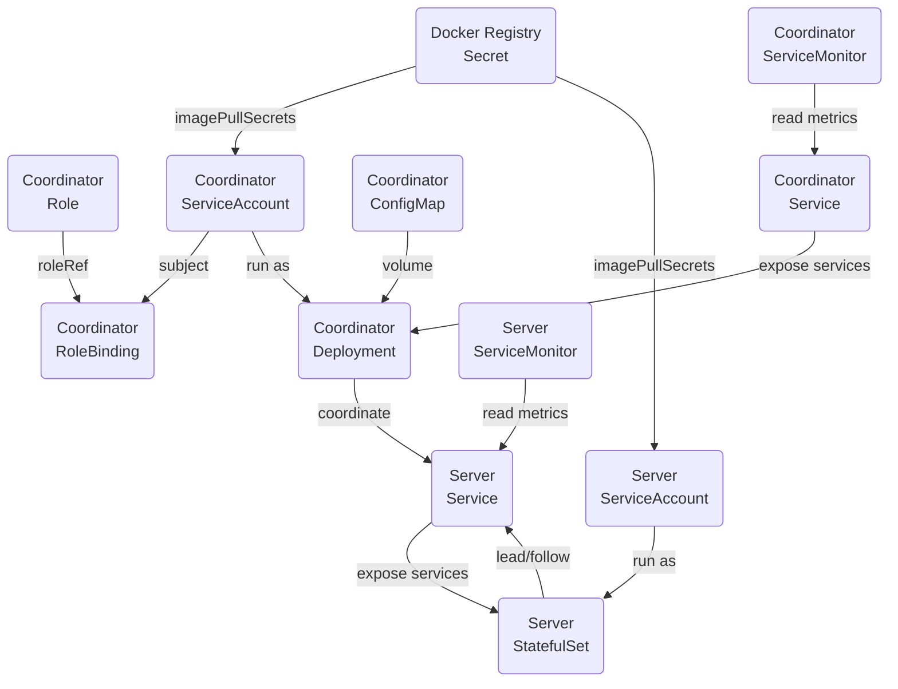

# Kubernetes Resources

## Prerequisites

### Docker Registry Secret

Pods need to be able to authenticate with image registries to pull images. In this case the oxia image needs to be
retrieved for the operator controller, cluster coordinator or server.

Typically, the authentication tokens are short-lived and expire. For example AWS ECR tokens expire after 12 hours.
Therefore, the tokens contained by the secret need to be regularly rotated.

This secret is left to the user to create and manage.

Kubernetes also supports
[Kubelet credential provider](https://kubernetes.io/docs/concepts/containers/images/#kubelet-credential-provider)
to dynamically fetch registry credentials for a container image. The method would eliminate the need to create a secret
and provide `imagePullSecrets` to Pods or ServiceAccounts.

### Storage Class

The Oxia servers require a storage class to be configured.

### Prometheus Operator

If ServiceMonitors are enabled, then the Prometheus operator must be installed.

## Coordinator

### ServiceAccount

This is the ServiceAccount account that the coordinator Pod runs as. It contains the `imagePullSecrets` to allow the Pod
to pull the Oxia image. It is also bound to a Role to allow it to perform necessary operations against the Kubernetes
API.

### Role

This Role contains all the permissions that the coordinator is allowed to perform against the Kubernetes API. Namely,
interacting with ConfigMaps to allow it to store cluster status metadata.

### RoleBinding

This binds the Role to the ServiceAccount.

### ConfigMap

The coordinator has two ConfigMaps.

#### Config

This contains the cluster configuration: `replicationFactor`, `initialShardCount` and the list of the public and internal
bind addresses of all the servers in the cluster. It is mounted as a yaml file in the coordinator container.

#### Status

This is created and updated by the coordinator periodically. It is used to recover state on restarts.

### Deployment

This runs the coordinator container. It has a single replica. The above ConfigMap configuration is mounted as a file in
the container.

### Service

This exposes the coordinator's RPC and metrics endpoints to the Kubernetes network. This is a standard `ClusterIP`
service.

### ServiceMonitor

This optional resources instructs the Prometheus operator to scrape service's metrics.

## Server

### ServiceAccount

This is the ServiceAccount account that the server Pods runs as. It contains the `imagePullSecrets` to allow the Pod
to pull the Oxia image.

### StatefulSet

This runs the server containers. They have a disk mounted using the configurable `storageClassName`. If this is not
specified it will use the cluster default. The storageClass configuration is left to the user.

### Service

This exposes the servers RPC and metrics endpoints to the Kubernetes network. This is a
[Headless Service](https://kubernetes.io/docs/concepts/services-networking/service/#headless-services) which allows
each Pod to have its own Kubernetes DNS entry - `{service-name}-{pod-ordinal}`. The Oxia client can bootstrap with
`{service-name}`, however there is no load-balancer. Kubernetes DNS will randomize which Pod IP is returned. This should
be taken into account when considering DNS caching.

### ServiceMonitor

This optional resource instructs the Prometheus operator to scrape service's metrics.

## Resource Relationships

