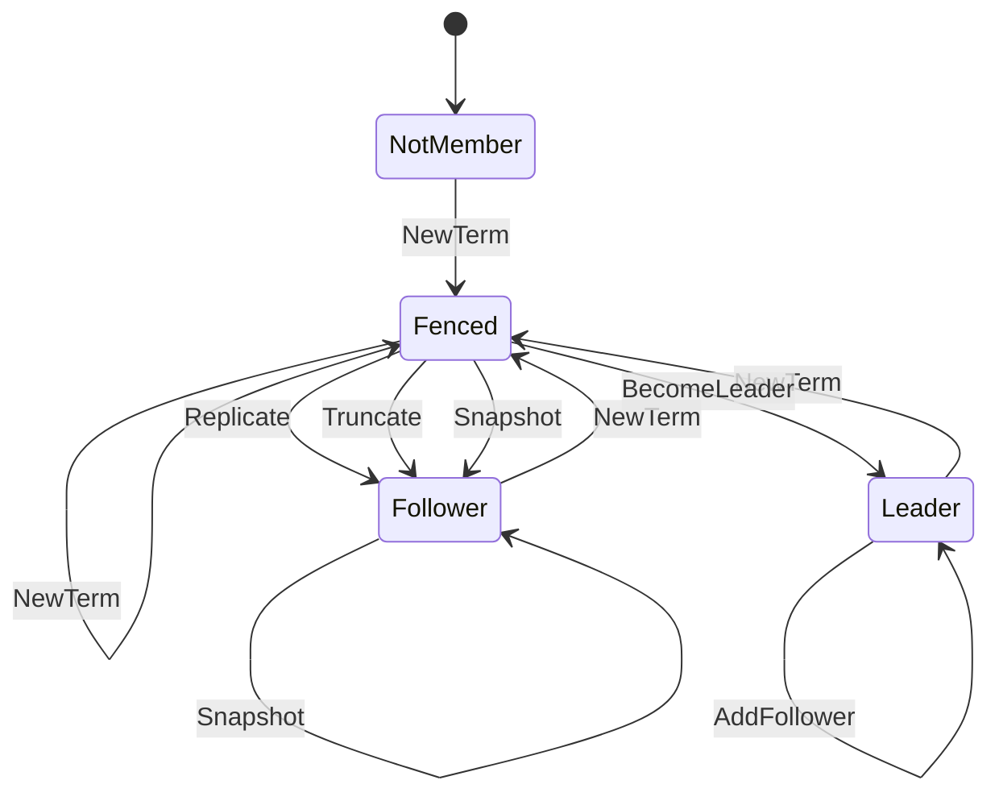
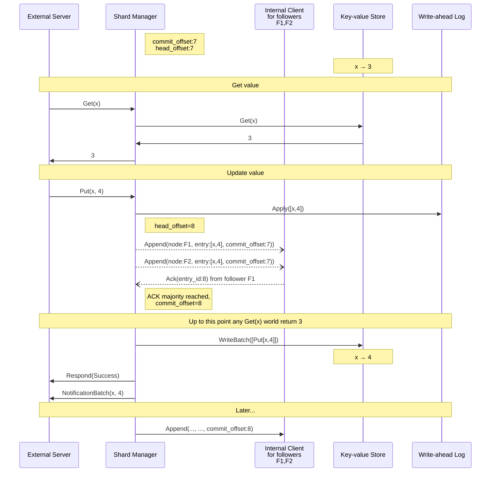
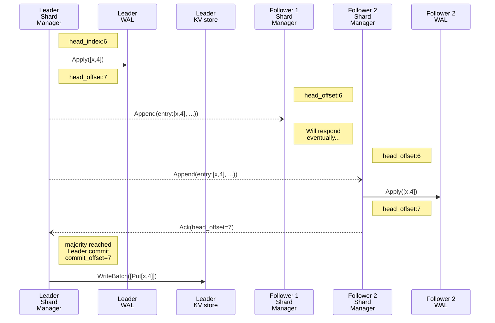
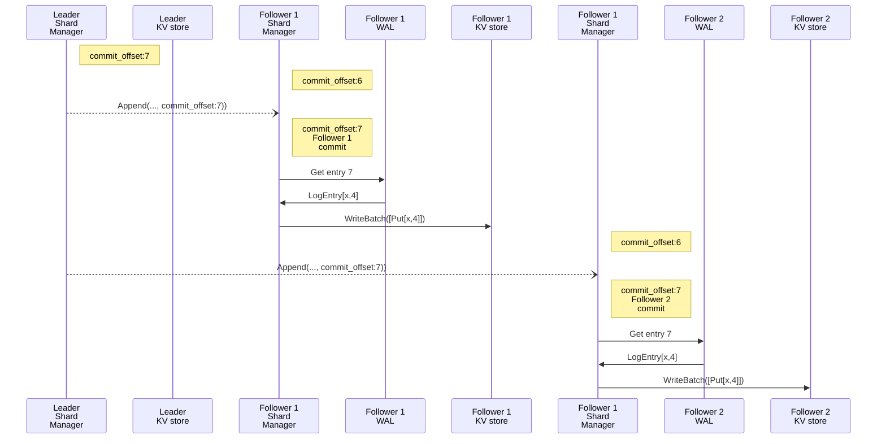
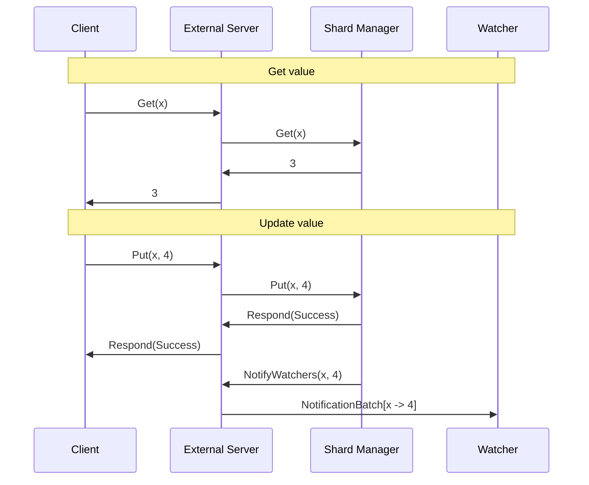

# Storage

Part of the Replication Protocol that is concerned with the reading and writing of data within a cluster of storage
nodes, under the assumption that it is in a steady state. It is not concerned with the assignment of node roles within
the cluster, which instead falls within the scope of the [coordinator section](replication-coordinator.md) of the
protocol.

## Starting conditions

The coordinator will assign a given shard to 1 node as the "leader" and 0+ nodes as "followers". The cluster
configuration will have a way to specify the desired replication factor for the data, and to adjust it dynamically.

> ⚠️ In all cases described below, it is assumed that where requests and responses require a "term", they use the 
> current "term". As such we can safely ignore the concept of term in this section. This also means, that for the
> purpose of these descriptions we can assume that `entry_id` is equivalent to `offset` (it is normally `[term,offset]`).


## State diagram

This diagram describes all the possible state transitions for a storage server, with respect to a given shard.



 * `NotMember`: The node does not belong to the ensemble for the shard
 * `Fenced`: The node is being synced by the coordinator. It will not accept any client operations
 * `Follower`: Node is only accepting replication feed from leader from the current `term`
 * `Leader`: The node has been elected leader for the shard, and it's serving read/write requests for users

## Anatomy of a write operation

When a client sends a write operation to a shard leader.

### Overview

On receiving a write operation the shard leader will first write to its own WAL as an entry. Once successful, it will
then attempt to forward the entry to all of its followers who will in turn persist accept and persist it to their WALs,
and eventually their KV stores. The shard leader blocks until it has received acknowledgements from a majority of the 
followers, and the entry can be committed. The leader then writes the entry to the KV store. The leader can now send the
client a successful response.

### State

#### Current Shard state

On each storage node, for each shard, pointers are maintained that describe that persistence state of that shard replica,
managed by the `QuorumAckTracker`:

- **Head offset** — the index of the most recent entry written in the local WAL of the leader
- **Commit offset** — the most recent entry that is considered "fully committed", as it has received the required amount 
   of acknowledgements from followers (`Ack` with the correct `entry_id`).

In the example bellow we see that `e4` has been successfully written to the logs of a quorum of followers, and that `e5`
has been written to the leaders log. However, despite forwarding `e5` to followers, we have not as yet received
sufficient follower acks to allow us to advance the `commit_offset`. The leader’s `head_offset` will always be at, or no
more than one entry in advance of the `commit_offset`.

[Oxia Storage Node Indexes](https://docs.google.com/drawings/d/12W1lMf-xU5g05GvTDmOjr-KBs2d63iwyoo59mWtxSeI/edit?usp=drivesdk)

Note that if the leader does not get a majority of acks, it will be blocked from committing further writes. It will
still be able to accept uncommitted writes to its WAL however, and distribute those to followers.

### Follow Cursor

The leader also maintains state concerning the last known WAL state of the shard’s followers. The leader uses this 
cursor to determine which entries each follower needs to receive, and which it already had. For each follower the cursor
records the id of the entry most recently pushed to the follower (`last_pushed`), and the greatest entry id for which it
has received and acknowledgement from the follower (`ack_offset`).

## Write interactions



> ℹ️ This diagram assumes 2 followers and 1 leader.

> ⚠️ When a majority of storage nodes (leaders + followers) have acknowledged an entry, no new leader can be selected 
> that does not have that entry.

## Leader

A leader will accept client  `Put` / `Get` / `Delete` requests for the shards it has been assigned — these will trigger
a replication that hopefully results in a commit. Any read operation issued by the client will be served from the 
leader’s underlying key-value store.

Write operations are appended as `LogEntries` to the local WAL. Entries are also sent to each follower as an 
`Append` with the intention that they write them to their local WAL. Once a majority of followers have sent 
back `Ack` confirming that they have persisted the entry in their WAL, then the leader will then:

1. Advance the local `FollowerCursor.AckOffset` it maintains for the follower
2. Apply the update to the local key-value store
3. Acknowledge the write operation to the client
4. Send notification events to subscribed clients

The leader’s `FollowerCursors` enable it to determine which followers a given entry must be forwarded.

## Follower

Followers do not accept shard reads or writes from external clients — in the context of the data path, they only interact
with the leader.  Followers are meant to be very close replicas of the leader; they tail the leader WAL, attempting to 
reach the current `head_offset`. They also apply changes to their local KV stores up to the current `commit_offset`. This 
allows the followers, when it is required, to be promoted to leader in very short amount of time.

To begin with, the leader connects to followers and opens up a bidirectional stream:

```protobuf
rpc Replicate(stream Append) returns (stream Ack);
```

The followers are kept updated via the `Append` from the leader. These requests serve two distinct purposes. Primarily 
they contain new entries (`LogEntries`) which the follower will append to their WAL, incrementing their `head_offset`. 
But secondly, and less obviously, they contain the leader’s current `commit_offset`. This is used by the follower to
increment its own `commit_offset` and then apply entries from its WAL to its KV store.

> The name `Append` belies the important duality of this message — the role of the `commit_offset` almost seems to be a
> side-effect. However, it is critically important to ensure that follower’s KV stores are fresh so that they can adopt 
> a leader role in very short amount of time.

Followers return `Ack` to the leader to signal their current `head_offset`. This response is critically important as it 
serves as an acknowledgement to the leader that the follower has persisted the message to its WAL, forming part of the
leader’s commit mechanism.

## More detail

We have seen that some messages within the protocol perform multiple roles. Let’s bisect a write and emphasise the 
leader-follower interactions first for the purpose of replicating data, and secondly for the commit mechanism. These two
pathways operate concurrently.

> ℹ️ These diagrams assume 2 followers and 1 leader.

### `Append` — append/commit leader entry emphasis

The steps required for an entry to be committed from the perspective of a leader. Note that in the request passing, we 
only need concern ourselves with `Append.entry` here.



### `Append` — commit follower entry emphasis

The steps required for an entry to be committed from the perspective of a follower. Note that in the request passing, we
only need concern ourselves with `Append.commit_offset` here.



### Client/Server emphasis



# Replication in a steady state

The leader simply sends a stream of entries to each follower, keeping track via the follow cursors by updating the 
cursor fields:

- `last_pushed`
- `ack_offset`

The leader’s `commit_offset` can be advanced when an `entry_id` that is higher than the current commit index complies 
with the following conditions:

- The `entry_id` has reached majority quorum, based on the set of follow cursor’s `ack_offsets`
- The `entry_id` belongs to the current epoch
- the log prefix has reached majority quorum

